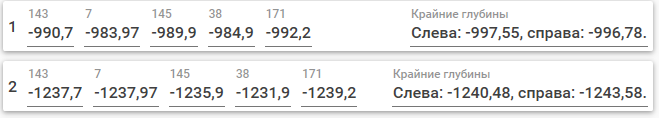

# Список изменений

## v3.0.2

- Снято ограничение на загрузку только положительных альтитуд.

## v3.0.1

- Исправлены ошибки вызывающие аварийное завершение приложения, возникающие в результате загрузки некорректных данных.

## v3.0.0

- Изменён метод работы с входными данными. Теперь пользователи могут изменять загруженный файл Excel извне (из Excel), и файл будет автоматически перезагружен. Также появилась возможность сохранять параметры, с которыми строится разрез, в загруженном файле. Это означает, что при перезапуске программы и загрузке сохранённого файла Excel также загрузятся масштабы построения и т. д.
- Теперь при переходе в модуль пользователь попадает на стартовую страницу с описанием возможных действий и историей работы с проектами (файлами Excel).
- Основные данные скважин, ГИС, разбивок и колонок оформления теперь нельзя изменять из модуля.
- **Важно: изменены заголовки некоторых колонок в файлах Excel. Их необходимо изменить в существующих файлах.** На листе "Скважины" колонка "Скв." переименована в "Скважина", "ALT" - в "Альтитуда"; на листе "Геофизика" колонка "Скв." переименована в "Скважина". 
- Добавлена возможность наносить надписи на скважины. 
- Переработан пользовательский интерфейс.
- Обновлена справка пользователя.

## v2.1.0

- Дополнена и обновлена справка пользователя. Название страницы "Подготовка данных" изменено на "Подготовка данных в Excel". Название страницы "Загрузка данных изменено на "Загрузка данных в Rack". Обновлён раздел "Разбивки". Добавлен раздел "Определение нефтеносных пластов".

## v2.0.2

- Дополнены и исправлены страницы справки пользователя "5. Утилита GrdToShpfile" и "6. Оформление разреза в ArcMap".

## v2.0.1

- Исправлена ошибка, из-за которой при задании неверного горзионтального или вертикального масштаба программа аварийно закрывалась.

## v2.0.0

- Модуль переведён на новую архитектуру, реализовано множество мелких улучшений.

## 26.03.2020

- В шейп-файле Разбивки.shp линии разбивок, располагающиеся между верхней и нижней, принимают значение атрибута "Type" = "Middle" вместо пустой строки.

## 24.03.2020

- При создании файлов для построения разреза в шейп-файл Разбивки.shp добавляется атрибут "Type". Самая верхняя разбивка принимает значения "Top", а самая нижняя - "Bottom".
- Для каждой разбивки добавлено расчётное значение глубины в самой левой и самой правой точке разреза (с учётом отступа):  
 

## 23.03.2020

- Исправлена ошибка, из-за которой при создании файлов для построения разрезов в файле ГИС.tsv некорректно рассчитывалась масштабированная глубина.
- Добавлена возможность выбора кодировки создаваемых файлов. Так как старые версии ArcMap и даже актуальные версии GST не поддерживают современные кодировки (UTF-8), по умолчанию теперь используется Windows-1251.

## 27.02.2020

- Все абсолютные отметки ниже уровня моря теперь задаются со знаком минуса. Добавлена возможность задавать абсолютные отметки выше уровня моря. **В файлах Excel с исходными данными на листе "Колонки оформления" добавьте ко всем числовым значениям в колонках "От" и "До" знак минуса.**
- При создании файлов для построения разрезов, включающих в себя уровень моря, будет также создан шейп-файл "Нулевая отметка.shp", содержащий прямой горизонтальный отрезок от левого до правого края разреза на уровне моря. 

## 26.02.2020

- Исправлена ошибка, возникавшая при загрузке книг Excel с данными, где на листе "Колонки оформления" не были указаны значения в колонках "От" и "До". 
