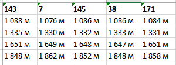

## Подготовка данных в Excel

Перед построением разреза необходимо подготовить данные. Для этого используется Microsoft Excel.

### Создание образца

1. Выберите команду "Создать образец" на стартовом экране либо, если вы уже работаете с другим проектом, на панели инструментов.  

2. Диалоговое окно позволяет выбрать, заполнять ли образец фиктивными данными для примера. Если вы ещё незнакомы с форматом входных данных и хотите построить разрез для примера, выберите "Да".  

3. Выберите, куда сохранить образец (если вы выбрали на шаге 2 ответ "Да", в выбранную директорию также будут помещены тестовые структурные карты).  

### Заполнение образца данными

1. Откройте образец в Microsoft Excel. В книге содержатся два обязательных листа: "Скважины" и "Геофизика"; два дополнительных листа: "Колонки" и "Разбивки", а также другие необязательные листы. Не переименовывайте и не удаляйте эти листы.  

2. Лист "Скважины" содержит данные по скважинам, использующимся при построении разреза. В колонке "Скважина" указывается название скважины, в "Альтитуда" - альтитуда скважины, "X" и "Y" - координаты скважины, "Забой" - забой скважины. Если для забоя или альтитуды не указаны единицы измерения, используются метры. Наличие колонки "Учитывается при построении" необязательно, её значения могут быть изменены из Rack.  
  
3. Лист "Геофизика" содержит геофизические данные для каждой скважины, указанной на листе "Скважины". В колонке "Скважина" указывается название скважины, в "Кровля" - кровля интервала, в "Подошва" - подошва интервала, в "ПС" - измеренный в интервале физический параметр. Кровля и подошва указываются относительно альтитуды скважины, если не указана единица измерения, используются метры.  
  
1. Лист "Колонки" содержит данные для создания колонок оформления разреза. В колонке "Заголовок" указывается заголовок колонки, в колонке "Текст" - текст интервала в колонке, в колонках "Верх (слева)", "Низ (слева)", "Верх (справа)", "Низ (справа)" - границы интервала. Границы указываются как абсолютные отметки, если не задана единица измерения, то используются метры. Колонка "Режим отображения" является необязательной и может быть изменена из Rack.  
  
1. Лист "Разбивки" содержит данные для создания разбивок разреза. Для каждой скважины, участвующей в построении, необходимо создать колонку, в первой ячейке записать название скважины. Для каждой разбивки нужно создать строку, и в соответствующих ячейках заполнить значения разбивки для каждой скважины (относительная глубина, если не указаны единицы измерения, используются метры).  

Заполните листы данными для построения разреза, если это необходимо, и сохраните книгу.

### Подготовка структурных карт:

Определите, какие структурные карты потребуются при построении разреза. В построении разреза должны участвовать как минимум две структурные карты, обозначающие верхнюю и нижнюю границу разреза соотвественно. Структурные карты должны быть представлены .grd-файлами.