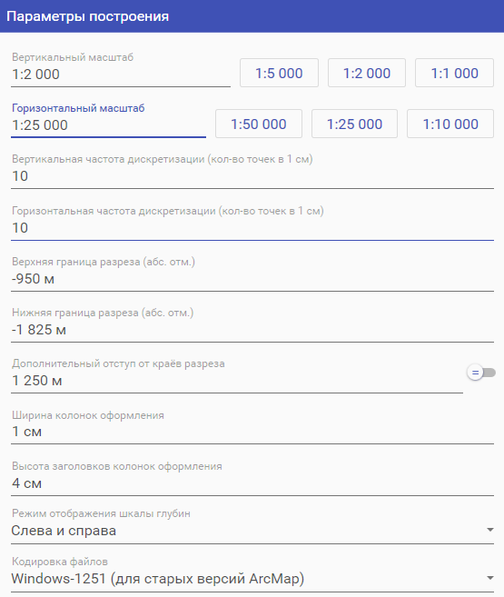

## Загрузка данных в Rack

Выберите команду "Загрузить данные из Excel файла" на стартовом экране или на панели инструментов и откройте файл с данными для построения разреза. Если вы недавно уже открывали файл, выберите его из списка "История".  

Если загрузка прошла успешно, вы получите соответствующее сообщение.  

Загруженные данные отобразятся в секциях "Загруженные данные для построения", "Параметры построения" и "Дополнительные элементы оформления".

### Загруженные данные для построения

В секции отображаются наиболее важные данные, необходимые для построения разреза.

#### Скважины

В таблице отображаются данные по каждой загруженной скважине. Доступна возможность исключить скважину из построения разреза. Порядок, название, альтитуда, координаты и забой скважины могут быть изменены пользователем только извне (с помощью Excel), файл автоматически перезагрузится. 

Команда "Отобразить линию разреза" открывает новое окно, которое позволяет визуально оценить линию разреза, проходящую через скважины.  
  
  

Команда "Показать геофизику для скважины" открывает окно с геофизическими данными для соотвесттвующей скважины. Эти данные не могут быть изменены.  
  

Скважины могут быть исключены из построения разреза с помощью нажатия на соответствующий флажок.  

Порядок следования скважин может быть изменён извне (с помощью Excel). Порядок скважин влияет на линию разреза, так как при построении разреза скважины, идущие сверху вниз, будут располагаться на разрезе слева направо.   

#### Структурные карты

В таблице отображаются названия и параметры каждой загруженной структурной карты. Загруженные карты могут быть добавлены и удалены с помощью команд "Загрузить структурные карты из грид файлов" и "Удалить структурную карту" соответственно.
  

#### Разбивки

В таблице отображаются данные по каждой загруженной разбивке. Эти данные могут быть изменены только извне (из Excel).  
Также, если это возможно, рассчитываются и отображаются крайние глубины для каждой разбивки (при задании ненулевого отступа в настройках эти глубины будут отличаться от значений разбивки в крайних скважинах из-за интерполяции по структурным картам).

### Параметры построения

Секция содержит параметры построения разреза. Пользователю необходимо указать вертикальный и горизонтальный масштаб разреза, верхнюю и нижнюю абсолютную глубину разреза в метрах, и, если необходимо, дополнительный отступ от краёв разреза.  
**Вертикальный** и **горизонтальный масштаб** в описании не нуждаются.
**Вертикальная частота дискретизации** обозначает минимальное гарантированное количество точек ГИС для каждой скважины в 1 см построенного разреза. Увеличение этого параметра приведёт к созданию большего количества точек с ГИС для каждой скважины и, следовательно, к построению более подробного разреза, но также к увеличению времени генерации файлов для построения разреза и к увеличению размера самих файлов.  
**Горизонтальная частота дискретизации** обозначает минимальное гарантированное количество точек для каждой разбивки или структурной карты в 1 см построенного разреза. Увеличение этого параметра приведёт к построению более плавных линий разбивок, но также к увеличению времени генерации файлов для построения разреза и к увеличению размера самих файлов.  
**Верхняя** и **нижняя граница разреза** определяет верхнюю и нижнюю границу построения разреза соответственно. Границы задаются в абсолютных отметках глубины.  
Параметр **Дополнительный отступ от краёв разреза** позволяет задать отступ крайних скважин от краёв разреза. Отступ может задаваться как с учётом горизонтального масштаба (например, при отступе = 4 см между первой скважиной и началом разреза будет зазор в 4 см), так и без него (например, при отступе = 1250 м и горизонтальном масштабе = 1:25 000 размер зазора составит 5 см). Режим учёта горизонтального масштаба в отступе задаётся переключателем справа от поля.  
**Ширина колонок оформления** позволяет задать ширину колонок оформления слева и справа от основной области разреза.  
**Высота заголовков колонок оформления** позволяет задать высоту заголовков колонок оформления.  
**Режим отображены шкалы глубин** позволяет задать, как нужно отображать шкалу глубин на разрезе. Подробнее см. ниже в секции "Колонки оформления".  
**Кодировка файлов** позволяет задать кодировку выходных файлов.  
**Информация о разрезе** содержит предварительные сведения о разрезе.
- *Размер основной области разреза* показывает ширину и высоту основной области (без колонок оформления) строящегося разреза.  
- *Размер разреза с учётом декоративных элементов* показывает ширину и высоту строящегося разреза с учётом колонок оформления.  
- *Количество точек дискретизации* показывает, сколько примерно точек с отдельными значениями ГИС будет рассчитано по каждой скважине, и сколько примерно отдельных точек будет в каждой линии разбивки.  

### Дополнительные элементы оформления

#### Колонки оформления

В таблице отображаются данные по каждой загруженной колонке оформления. Данные и порядок колонок могут быть изменены извне (из Excel). Порядок колонок сверху вниз соответствует порядку слева направо в правой части разреза и порядку справа налево в левой части разреза. Можно выбрать один из желаемых режимов отрисовки колонки: "Скрыть" (колонка не появится на разрезе), "Только слева" (колонка будет отрисована только слева от разреза), "Только справа" (колонка будет отрисована только справа от разреза) или "Слева и справа" (колонка будет отрисована и слева, и справа от разреза).  

### Нефтеносные пласты

При наличии разбивок можно определить нефтеносные пласты, задав для них нижнюю и верхнюю разбивку. На данный момент определение нефтеносных пластов приводит к появлению шейп-файла с полигонами-заливками, расположенными между указанными разбивками. Пласты могут добавляться, редактироваться и удаляться из Rack.  

### Подписи на скважинах

В этой таблице можно добавить подписи на любую из скважин. Для этого необходимо выбрать скважину, верхниюю и нижнюю границу подписи, а также текст подписи (многострочный).  

