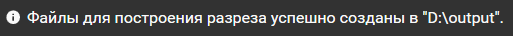
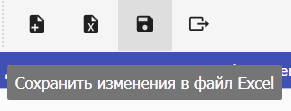

## Создание файлов для построения разреза

После того, как все необходимые для построения разреза данные загружены и введены, вызовите команду **"Создать файлы для построения разреза"**. Выберите директорию, в которой будут сохранены файлы. Дождитесь сообщения об успешном завершении операции.  
  

Будут созданы следующие файлы:

- **ГИС.tsv**: таблица ГИС в текстовом формате. В колонке "Название скважины" указывается название соответствующей скважины, в "l (м)" указывается расстояние скважины от начала разреза, в "l (масштаб, см)" указывается масштабированное расстояние скважины от начала разреза в см, в "h (м)" указывается абсолютная глубина, в "h (масштаб, м)" указывается масштабированная глубина в см, в "PS" указывается значение ПС в соответствующей скважине на соответствующей глубине.
- **Колонки.shp** и сопутствующие файлы: колонки оформления в формате шейп-файла. Каждый элемент в шейп-файле является прямоугольным полигоном. Колонка *"Label"* содержит текст для отрисовки внутри полигона, *"Type"* принимает одно из следующих значений: *"Header"* (заголовок колонки), "Background" (тело колонки), "Scale" (элемент линейки глубины), "Content" (элемент колонки), *"Position"* принимает либо значение "Left", либо значение "Right".
- **Область.shp** и сопутствующие файлы: основная область разреза в формате шейп-файла. Шейп-файл содержит единственный прямоугольный полигон.
- **Обрезка.shp**  и сопутствующие файлы: основная область разреза, вертикально обрезанная по разбивкам, в формате шейп-файла. Каждый элемент в шейп-файле является полигоном.
- **Разбивки.shp** и сопутствующие файлы: разбивки в формате шейп-файла. Каждый элемент в шейп-файле является полилинией. Колонка "A" содержит значения такие, что при 0 соответствующая разбивка полностью соответствует самой верхней структурной карте, а при 100 - самой нижней структурной карте разреза.
- **Скважины.shp** и сопутствующие файлы: обозначения для скважин в формате шейп-файла. Каждый элемент в шейп-файле является полилинией. Колонка "Well" содержит название скважины, "Altitude" - альтитуду, "Bottom" - забой.
- **Структурные карты.shp** и сопутствующие файлы: структурные карты в формате шейп-файла. Каждый элемент в шейп-файле является полилинией. Колонка "Name" содержит название структурной карты.
- **Нефтеносные пласты.shp** и сопутствующие файлы: заливки между разбивками для выделения нефтеносных пластов. Каждый элемент в шейп-файле является полигоном.
- **Подписи скважин.shp** и сопутствующие файлы: подписи скважин. Колонка "Скважина" содержит название скважины, "Текст" - текст подписи.
- **Нулевая отметка.shp** и сопутствующие файлы: горизонтальная линия на уровне моря.

## Сохранение проекта

Вызовите команду "Сохранить изменения в файл Excel". Файл, из которого были загружены данные для построения, будет перезаписан. В него будут добавлены все параметры и декоративные элементы, использованные при построении разреза. При следующем открытии этого файла вы cможете сразу приступить к построению разреза.  

