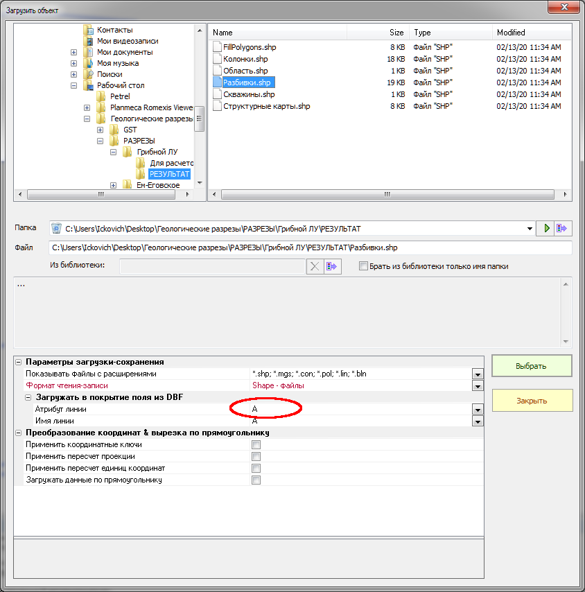

## Построение разреза в GST

1. Откройте существующий проект GST, использующийся в качестве шаблона в вашей работе.
2. Загрузите **таблицу ГИС** (ГИС.tsv). Для того, чтобы файл стал виден, необходимо показать все расширения.  

3. Загрузите покрытие **Разбивки**. При загрузке нового покрытия обязательно следует указать атрибут линии - **поле А**. При обновлении покрытия атрибут обновляется автоматически.  

4. Загрузите полигональное покрытие **Обрезка**, просто указав путь к файлу.  
5. Для правильной отрисовки разреза постройте вспомогательный грид - **Расчет**. В параметрах построения нажмите кнопку **"По значимым ссылкам"**.  

6. Далее постройте сам разрез. Границы грида установите **по другому гриду**, в качестве которого указываем **"Расчет"**. Выполните построение.

7. Для корректировки построения вы можете менять:  
а) веса на данные ГИС  
  
б) веса на глобальные уравнения  

  
8. Сохраните построенный грид. Коэффициент сгущения грида по умолчанию равен 1. Его можно увеличить для большей плавности линий. Слишком большой коэффициент может привести к значительному увеличению времени прорисовки итогового шейп-файла или затруднить конвертацию grd2shp.  
  
9. Для оформления в ArcMap необходимо перевести полученный .grd-файл в .shp-файл. Для этого используется приложение **Grd2Shp.exe**.
