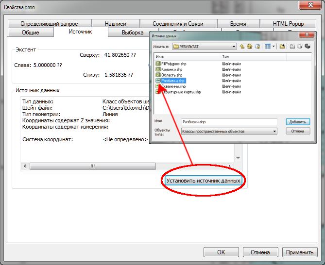
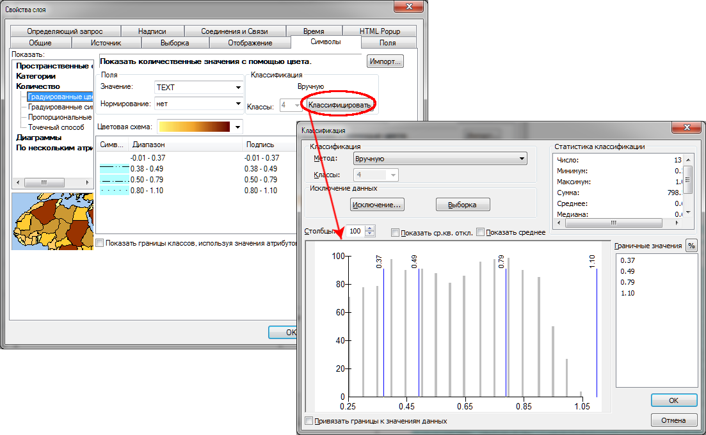
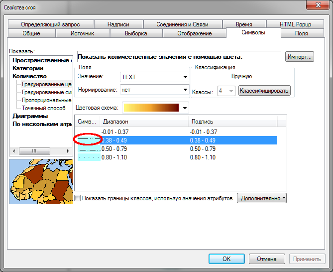
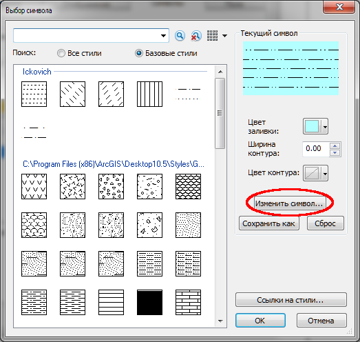
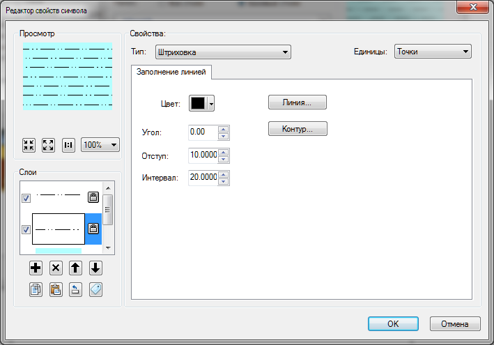

## Оформление разреза в ArcMap

1. Скопируйте проект ArcMap.mxd в папку с разрезом и откройте его. Укажите новые пути к файлам.  

2. Получите оформленный разрез. Для корректировки границ изменения литологического состава горных пород используйте символы слоя **«Литологический состав»**.  
**Обратите внимание, что диапазоны классов являются дискретными.** То есть, если необходимо отрисовать глины по параметру x так, что параметр x < 0.25, то диапазон соответствующего класса будет 0-0.24, а следующего за ним — 0.25-...
  
Для изменения символов используйте инструмент "Выбор символа".  

