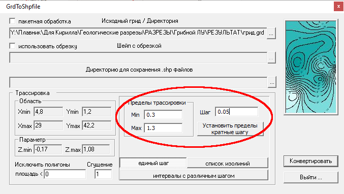
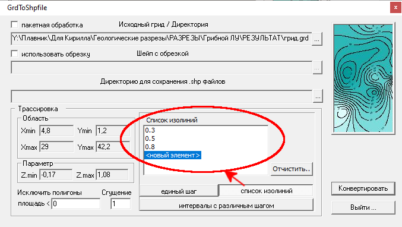

## Утилита GrdToShpfile

Утилита используется для создания .shp файлов с геометрическими данными из .grd файлов с регулярными сетками. Здесь реализованы два типа трассировки: с единым шагом и по списку задаваемых изолиний. 

1. Трассировка **«с единым шагом»** используется преимущественно для оформления карт. Здесь задаются: исходный грид, директория для сохранения результата обработки, минимальная, максимальная изолиния и шаг трассировки. Есть возможность убрать слишком маленькие полигоны, задав соответствующее значение в поле **«Исключить полигоны площадь <»**. Для увеличения количества точек в получаемых изолиниях можно задать параметр **Сгущение**.  

2. Для оформления геологических разрезов используется трассировка **«список изолиний»**. Здесь задаются те значения изолиний, которые нужно трассировать. Для увеличения скорости отрисовки разреза количество изолиний желательно указывать соответственно выделяемым литотипам.  
  
Например, необходимо разделить литотипы по параметру x следующим образом:  
    * глины: 0 <= x < 0.25;
    * алевролиты: 0.25 <= x < 0.41;
    * алевролито-песчаные отложения: полуинтервал 0.41 <= x < 0.76;
    * песчаники: 0.76 <= x <= 1.

    Тогда список изолиниий будет следующим:
    
    * 0.25
    * 0.41
    * 0.76

Во всех вариантах можно использовать **пакетную обработку**, которая заключается в одновременной конвертации нескольких гридов с одинаковыми параметрами трассировки.

Функции **использовать обрезку** и **интервалы с различным шагом** в текущей версии утилиты не работают.
